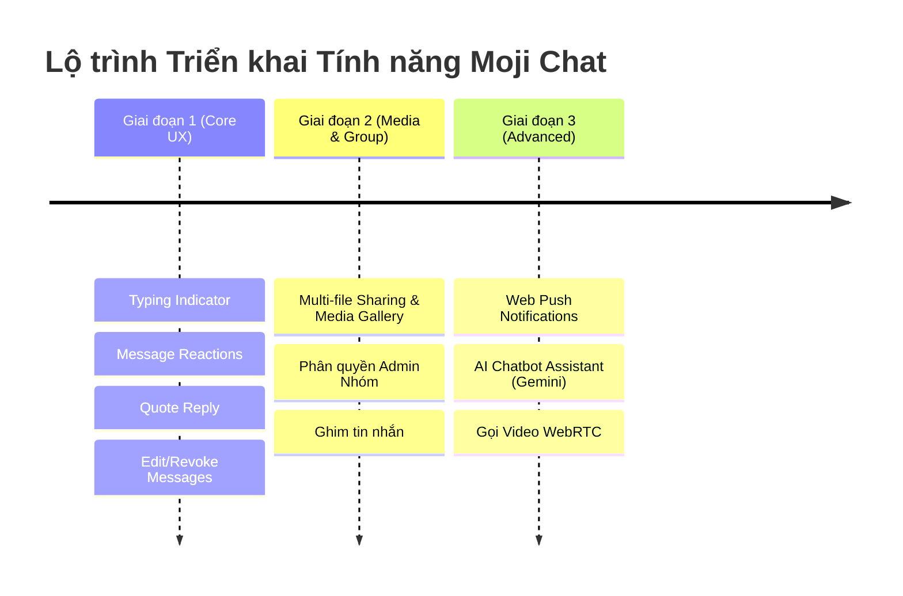

# 🚀 Lộ trình Phát triển Tính năng - Moji Chat App

Tài liệu này tổng hợp các tính năng đề xuất và lộ trình triển khai chi tiết cho ứng dụng trò chuyện thời gian thực **Moji Chat**.

---

## 📌 Tổng quan các Hạng mục Tính năng

### 1. 💬 Trải nghiệm Trò chuyện & Tương tác (Core Messaging)
- [x] **Thả cảm xúc tin nhắn (Message Reactions):**
  - Thả emoji (👍, ❤️, 😂, 😮, 😢, 🔥) trên từng tin nhắn.
  - Cập nhật thời gian thực danh sách & số lượng cảm xúc qua Socket.io.
- [x] **Trả lời tin nhắn (Reply / Quote Message):**
  - Trích dẫn tin nhắn cũ để phản hồi theo luồng ngữ cảnh (Thread view).
- [x] **Thu hồi tin nhắn (Revoke Message):**
  - **Thu hồi:** Xóa tin nhắn ở phía server & chuyển nội dung thành *"Tin nhắn đã được thu hồi"*. Cập nhật thời gian thực qua Socket.io.
- [ ] **Chỉnh sửa tin nhắn (Edit Message):**
  - **Chỉnh sửa:** Cập nhật nội dung tin nhắn và hiển thị nhãn *(Đã chỉnh sửa)*.
- [ ] **Trạng thái đang gõ (Typing Indicator):**
  - Hiển thị hiệu ứng `User X đang gõ...` khi người dùng đang nhập văn bản.
- [ ] **Ghi âm & Tin nhắn thoại (Voice Messages):**
  - Thu âm trực tiếp trên ứng dụng web qua Web Audio API & hiển thị trình phát sóng âm (Waveform).

---

### 2. 📁 Đa phương tiện & Chia sẻ File (Media & Files)
- [ ] **Gửi nhiều định dạng File & Xem trước (Multi-file & Document Sharing):**
  - Gửi hàng loạt ảnh, video, tài liệu (PDF, Word, Zip).
  - Tích hợp bộ sưu tập phương tiện đã gửi (**Media Gallery / Shared Files**) trong chi tiết cuộc trò chuyện.
- [ ] **GIF & Sticker (Giphy Integration):**
  - Tìm kiếm và gửi ảnh GIF từ Giphy API hoặc kho Sticker động.

---

### 3. 👥 Quản lý Nhóm chat Nâng cao (Advanced Group Chat)
- [ ] **Phân quyền Quản trị viên (Group Roles & Admin Control):**
  - Các vai trò: `Admin`, `Co-Admin`, `Member`.
  - Phân quyền: Đổi tên/avatar nhóm, thêm/xóa thành viên, nhượng quyền Admin.
- [ ] **Ghim tin nhắn (Pinned Messages):**
  - Ghim các thông báo quan trọng lên đầu cửa sổ chat nhóm.
- [ ] **Mã QR & Link tham gia nhóm (Group Invite Link / QR Code):**
  - Tạo liên kết và mã QR giúp tham gia nhóm chat nhanh chóng.

---

### 4. 📞 Gọi thoại & Gọi Video Realtime (Voice & Video Call)
- [ ] **Tích hợp WebRTC Call:**
  - Gọi thoại (Audio Call) và Gọi Video (Video Call) 1-1 và gọi nhóm.
  - Sử dụng Socket.io làm kênh trao đổi tín hiệu (Signaling server).

---

### 5. 🤖 Trí tuệ nhân tạo (AI Enhancements)
- [ ] **Trợ lý AI trong khung chat (AI Chatbot Assistant):**
  - Thắc mắc hoặc tag `@AI` trong tin nhắn để trợ lý AI (Gemini API) phản hồi trực tiếp.
- [ ] **Tóm tắt cuộc trò chuyện (Chat Summarization):**
  - Sử dụng AI tóm tắt các tin nhắn nhóm đã bỏ lỡ khi vắng mặt.
- [ ] **Dịch tin nhắn tự động (Auto-Translation):**
  - Dịch nhanh tin nhắn sang các ngôn ngữ khác chỉ với 1 click.

---

### 6. 🔐 Bảo mật & Quyền riêng tư (Security & Privacy)
- [ ] **Tin nhắn tự hủy (Disappearing Messages):**
  - Đặt hẹn giờ tự động xóa tin nhắn sau khi xem (ví dụ: 10 giây, 1 giờ, 24 giờ).
- [ ] **Chặn & Báo xấu (Block & Report User):**
  - Chặn người dùng phiền phức & gửi báo cáo vi phạm.
- [ ] **Quản lý tài khoản & 2FA:**
  - Đổi mật khẩu, quên mật khẩu qua Email (OTP), bảo mật 2 lớp.

---

### 7. 🔔 Thông báo & Tùy biến UI/UX (Notifications & Customization)
- [ ] **Thông báo đẩy (Web Push Notifications):**
  - Nhận thông báo tin nhắn mới kể cả khi đóng ứng dụng hoặc chuyển tab.
- [ ] **Chủ đề & Hình nền Chat (Chat Wallpapers & Themes):**
  - Tùy chỉnh màu sắc khung chat, bong bóng tin nhắn và hình nền riêng cho từng hội thoại.
- [ ] **Âm thanh thông báo tùy chỉnh (Custom Sound):**
  - Bật/tắt hoặc đổi chuông thông báo tin nhắn.

---

## 📅 Lộ trình Triển khai Gợi ý (Development Phasing)

---
*Tài liệu này được tạo tự động và lưu trữ tại [ROADMAP.md](file:///c:/Users/pc/Desktop/reactjs/Moji_RealtimeChatApp/ROADMAP.md) để phục vụ quá trình phát triển dự án.*
